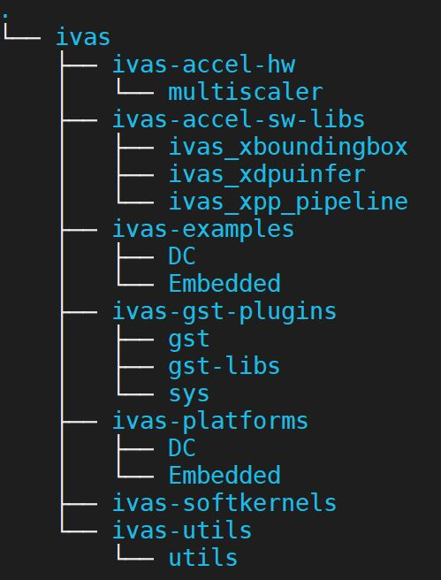

# ivas

## Folder Structure



- **ivas-utis** core contains infrastructure libraries for ivas gstreamer plugins and kernel libraries
- **ivas-gst-plugins** contains IVAS specific gstreamer plugins
- **ivas-accel-sw-libs** contains IVAS specific kernel libs which are supported by ivas gstreamer infrastructure plugins
- **ivas-accel-hw** contains ivas HW kernels which can be build with vitis
- **ivas-examples** Empty at present, will contain example applications for using ivas stack
- **ivas-platform** contains sample ivas platforms
- **ivas-softkernels** Empty at present, will contain ivas soft kernel in future

***Note:*** Compile and installation of ivas software libraries need to follow below sequence:
```
	First  : ivas-utils
	Second : ivas-gst-plugins
	Third  : ivas-accel-sw-libs
```

## Build and install ivas essentials for embedded:
Following are the three ivas folders which are essential to build the IVAS software stack for any platform:
```
	ivas-utils, ivas-gst-plugins and ivas-accel-sw-libs
```
A helper script is provided in root of this repo to build and install ivas essentials for embedded devices.

Step 1 : Source sysroot
```
	source <sysroot path>/environment-setup-aarch64-xilinx-linux
```
Step 2 : Build
```
	./build-ivas-essential.sh Edge
```
Step 3 : copy ivas installer to embedded board
```
	scp install/ivas_installer.tar.gz <board ip>:/
```
Step 4 : Install ivas on embedded board
```
	cd /
	tar -xvf ivas_installer.tar.gz
```
